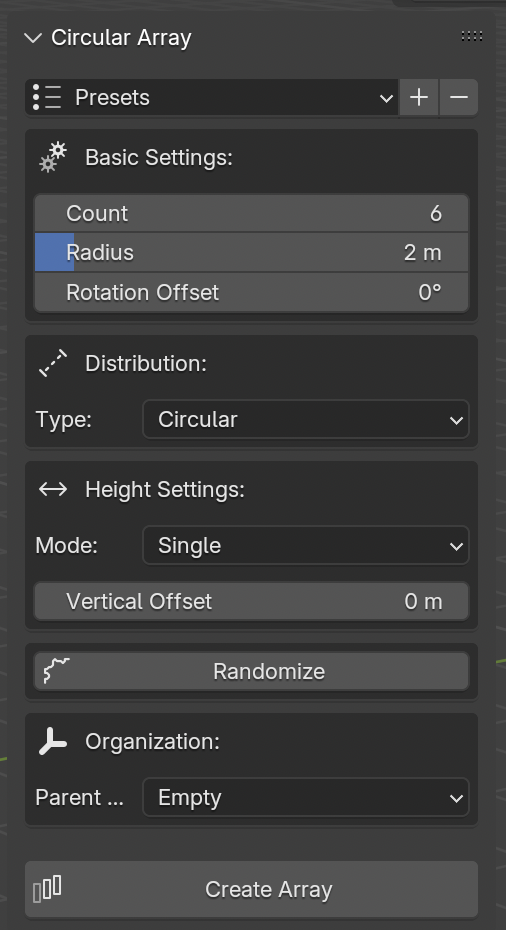

  

## Installation
1. Download the latest release from the releases page
2. In Blender, go to Edit > Preferences > Add-ons
3. Click "Install" and select the downloaded .zip file
4. Enable the addon by checking the box next to "Circular Array"

## Usage
1. Select an object in Object Mode
2. Open the N-panel in the 3D Viewport
3. Find the "Circular Array" tab
4. Adjust settings as needed:
   - Set basic parameters (count, radius)
   - Choose distribution mode
   - Configure vertical offset
   - Add randomization if desired
5. Click "Create Array" or "Update Array"

## Tips & Tricks
- Use curve mode for complex paths
- Combine vertical modes with randomization for organic results
- Save your favorite configurations as presets
- Parent to Empty for easier manipulation
- Use multiple objects for varied patterns

## Requirements
- Blender 3.0.0 or newer
- Windows/Mac/Linux compatible

## Support
For bug reports and feature requests, please use the GitHub issues page.
