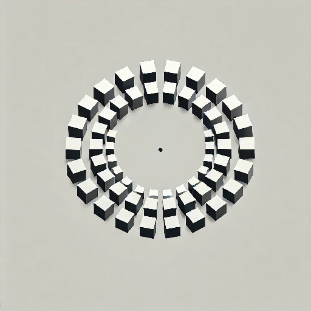

  

  

# Circular Array Addon for Blender

A powerful Blender addon that was entirely developed with the assistance of [CURSOR AI](https://www.cursor.com), creating advanced circular arrays with multiple distribution modes and extensive customization options.

## Features

### Distribution Modes
- **Circular**: Create perfect circular arrays with equal spacing
- **Elliptical**: Generate elliptical patterns with adjustable ratio and rotation
- **Curve**: Distribute objects along any curve with rotation following

### Basic Controls
- Adjustable count and radius
- Rotation offset control
- Flexible parent modes (Empty, Object, None)
- Multiple object support with spacing control

### Advanced Features
- **Vertical Offset Modes**:
  - Single: Same height for all objects
  - Incremental: Progressive height increase
  - Spiral: Create spiral patterns with revolution control
  
- **Curve Following**:
  - Object alignment to curve tangent
  - Adjustable up-axis orientation
  - Offset control (Factor or Distance based)
  
- **Randomization System**:
  - Scale variation
  - Rotation randomization
  - Position offset
  - Consistent results with seed control

- **Organization Options**:
  - Multiple parenting modes
  - Clean hierarchy management
  - Easy updates and modifications

### Preset System
- Built-in preset management
- Save and load custom configurations
- Quick access to common patterns

## Installation
1. Download the latest release from the releases page
2. In Blender, go to Edit > Preferences > Add-ons
3. Click "Install" and select the downloaded .zip file
4. Enable the addon by checking the box next to "Object: Circular Array"

## Usage
1. Select an object in Object Mode
2. Open the N-panel in the 3D Viewport
3. Find the "Circular Array" tab
4. Adjust settings as needed:
   - Set basic parameters (count, radius)
   - Choose distribution mode
   - Configure vertical offset
   - Add randomization if desired
5. Click "Create Array" or "Update Array"

## Tips & Tricks
- Use curve mode for complex paths
- Combine vertical modes with randomization for organic results
- Save your favorite configurations as presets
- Parent to Empty for easier manipulation
- Use multiple objects for varied patterns

## Version History
Current Version: 1.0
- Initial release with all core features
- Complete UI system
- Preset management
- Multiple distribution modes
- Advanced randomization

## Requirements
- Blender 3.0.0 or newer
- Windows/Mac/Linux compatible

## License
This project is licensed under the GPL-3.0 License - see the LICENSE file for details.

## Support
For bug reports and feature requests, please use the GitHub issues page.
